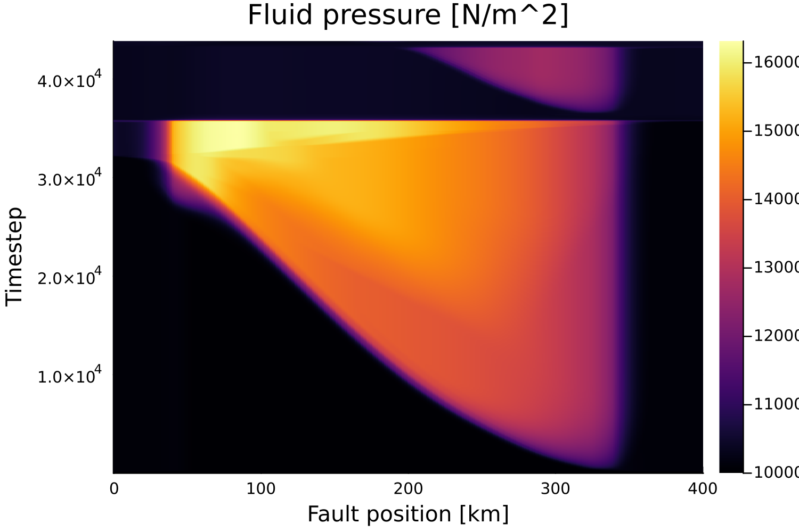
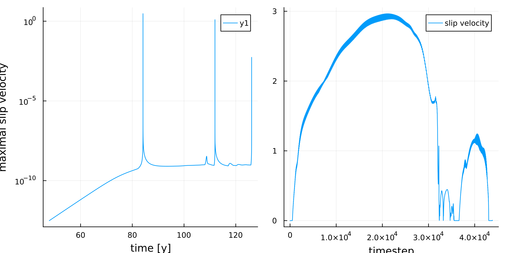

# H-MECs
This repository contains the code used for Hydro-Mechanical Earthquake Cycles (H-MECs) simulations. It relies on the Ginkgo library, which makes it possible to run the code on CPU and GPU with minimal changes, Nvidia, AMD and Intel are supported GPUs. The theoretical foundation of this simulation is given in:

Computational Earthquake Physics ETH Zurich, 2022 Dal Zilio, L., Hegyi, B., Behr, W. M., Gerya, T. (2022) Hydro-mechanical earthquake cycles in a poro-visco-elasto-plastic fluid-bearing fault structure DOI: https://doi.org/10.1016/j.tecto.2022.229516

## Structure
The repository is structured as follows:
```bash
H-MECs
├── cmake                   # cmake helper script to help installing dependencies
├── CMakeLists.txt
├── README.md
└── experiments             # Future numerical experiments can be added here
    ├── h-mec-rsf-eigen-v2  # Original C++ code
    ├── h-mec-rsf-eigen-v8
    ├── h-mec-rsf-eigen-v10 # Starting point for the first ginkgo version
    └── h-mec-rsf-ginkgo-v1 # Ginkgo version of eigen-v10
```

## Getting Started
The code depends on two libraries, Ginkgo for linear algebra and HDF5 as efficient file system. Before building the code repository make sure to have the dependencies installed:
### Installing Ginkgo
The code is built on the numerical algebra library Ginkgo. To install the Ginkgo library, refer to the install instructions from [Ginkgo](https://github.com/ginkgo-project/ginkgo/wiki/Tutorial-1:-Getting-Started).

### Installing HDF5
Instructions to install HDF5 can be found on the [HDF5](https://www.hdfgroup.org/download-hdf5/) website.

### Install H-MECs
Once you have the Ginkgo library installed you can proceed. In a terminal go to your preferred target directory and enter the following command to clone the git repository:
```bash
git clone git@github.com:NikMeier/H-MECs.git
```
The simulation is then built with standard cmake procedure:

```bash
cd H-MECs
mkdir build
cd build
cmake .. && cmake --build .
```

In the build directory you will find the experiment folder, containing all the experiments, for now only 'h-mecs-rsf-ginkgo-v1'.

## Running a experiment
To run the code go to the directory and run the executable:
```bash
cd experiments/h-mec-rsf-ginkgo-v1
./h_mec_rsf_ginkgo_v1
```
The output should look like this:
```bash
A 401 x 51 grid is simulated, starting at timestep = 0!
>> VW width = 33 (km)
>> Critical nucleation size = 2.47255 (km)
>> Cohesive zone = 500.691 [m]
Iteration #1!
dt = 5e+08s
Iteration #2!
dt = 5.87652e+06s
...
```

### Visualization of the results
Plotting the slip velocity shows the propagation of the event through the fault from right to left:

The next plot shows the fluid pressure along the fault:

A quick overview of the event can be made by looking at the maximal slip velocity, on the left on a time axis with logarithmic slip velocity, on the right plotted against numerical timestep on a linear scale:

## Running the experiment on GPU
To run the code on a GPU make sure to have the following option turned on, for AMD/Intel GPUs turn the corresponding options to ON:
```markdown
    # H-MECs/experiments/h-mec-rsf-ginkgo-v1/CMakeLists.txt
-DGINKGO_BUILD_CUDA=ON          # Build using CUDA for Nvidia devices
```

The final change to switch from the default CPU option to GPU is to uncomment these lines and comment the CPU executor configuration
```cpp
    # Comment the CPU executor
// ReferenceExecutor for debugging.
//inline const auto exec = gko::ReferenceExecutor::create();
//inline const auto gpu_exec = exec;

    # And uncomment the CUDA/HIP/SYCL executor
// OmpExecutor for CPUs
inline const auto exec = gko::OmpExecutor::create();

// CudaExecutor for Nvidia GPUs
inline const auto gpu_exec = gko::CudaExecutor::create(0, gko::OmpExecutor::create());
```
Make sure to rebuild before running the executable:
```bash
cmake --build .
```

Now we are ready to run the program accelerated on a GPU!

## Next steps

 - So far the solver implemented is a direct LU solver. The goal is to use iterative solvers to increase speed. Examples of how such a solver could look like are already contained in the code as comments, however the best configuration of the solver has still to be found.